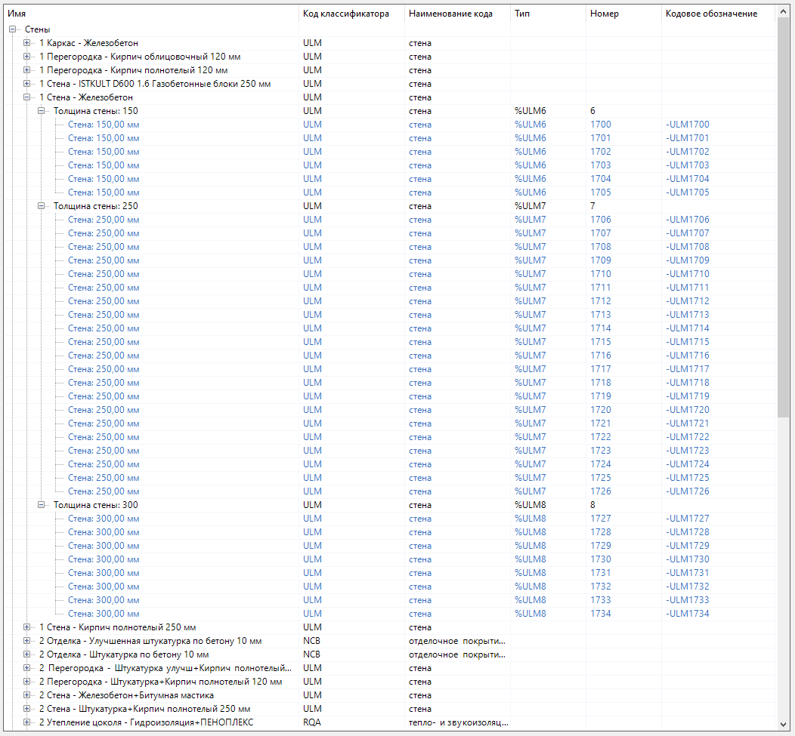

Примеры
=======

Добавление префикса в наименование автогрупп
--------------------------------------------

Наименование автогрупп берется из значений атрибута, указанного в ``autoGroupBy``. Опциональный атрибут ``prefixGroupName`` добавляет префикс в наименование групп. Рассмотрим пример правила для группы "Стены":

.. code-block::
    :caption: Правило декомпозиции группы "Стены".
    :linenos:

    {
      "groupName": "Стены",
      "filter": {
        "valueName": "ObjectType",
        "instruction": "exact",
        "value": "Wall"
      },
      "subgroups": [
        {
          "autoGroupBy": "Многослойный материал/Name",
          "subgroups": [
            {
              "autoGroupBy": "parameter/Толщина стены",
              "prefixGroupName": "Толщина стены: "
            }
          ]
        }
      ]
    }

В группу "Стены" отбираются все объекты ЦИМ с ``ObjectType`` равным ``Wall``. Декомпозиция объектов данной группы будет строится в два уровня. На первом уровне все объекты будут распределены по автогруппам по атрибуту ``Многослойный материал/Name``. На втором - каждая сформированная подгруппа будет декомпозирована ещё на более мелкие подгруппы по атрибуту ``parameter/Толщина стены``. Значение данного атрибута - это расчетная характеристика (численное значение) толщины стены. Чтобы наименование автогрупп сделать более информативным добавляем префикс "Толщина стены: " в параметре ``prefixGroupName``:

Группировка без объектов
------------------------

Существует возможность создавать группы, которые не будут хранить объекты, а только подгруппы. Рассмотрим пример правила для группы "Трубопроводные системы":

.. code-block::
    :caption: Правило декомпозиции группы "Трубопроводные системы".
    :linenos:

    {
        "groupName": "Трубопроводные системы",
        "storeSubgroupsOnly": true,
        "subgroups": [
            {
                "groupName": "Оборудование",
                // параметры группы
            },
            {
                "groupName": "Отопительное оборудование",
                // параметры группы
            },
            {
                "groupName": "Санитарные приборы",
                // параметры группы
            },
            {
                "groupName": "Трубы",
                // параметры группы
            },
            {
                "groupName": "Детали трубопровода",
                // параметры группы
            },
            {
                "groupName": "Трубопроводная арматура",
                // параметры группы
            }
        ]
    }

Группа "Трубопроводные системы" является подобием раздела для входящих в нее подгрупп, но сама по себе объектов не хранит, так как указан параметр ``"storeSubgroupsOnly": true`` (по-умолчанию значение равно ``false``). При значении, равным ``false``, все объекты, не вошедшие в подгруппы, стали бы принадлежать данной группе, поскольку у группы "Трубопроводные системы" не указан фильтр, т.е. она будет принимать все несгруппированные объекты ЦИМ:

.. csv-table::
    :widths: auto
    :align: center
    :header: "storeSubgroupsOnly = true", "storeSubgroupsOnly = false"

    .. image:: _static/storesubgroupsonly_true.png, .. image:: _static/storesubgroupsonly_false.png
