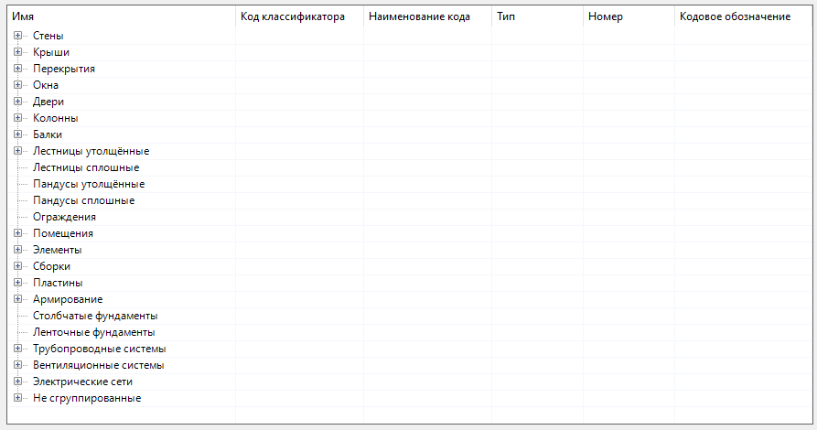
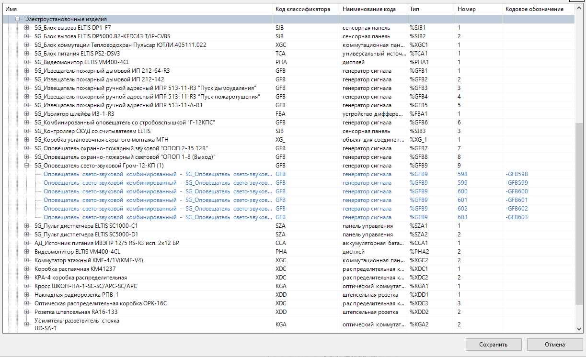

Группы (groups)
===============

Иерархия (дерево объектов) строится по группам объектов, схожим по определенным признакам.

Корневой или родительской группой является сама ЦИМ Renga, содержащая все объекты проекта. Объекты, в свою очередь, группируются по подгруппам внутри родительской группы по принципу 'от общего к частному':

.. code-block::
    :caption: Родительская группа ``Модель``, включащая все подгруппы дерева объектов.
    :linenos:

    {
        "groupName": "Модель",
        "subgroups": [
            {
                "groupName": "Стены",
                "subgroups": [..]
            },
            {
                "groupName": "Перекрытия",
                "subgroups": [..]
            },
            ..
        ]
    }

Корневая группа в дереве объектов не отображается, она служит только для формирования дальнейших подгрупп:

Количество подгрупп в одной группе и уровней вложенности подгрупп - не ограничивается. Таким образом, пользователь может построить любую произвольную иерархию объектов.

Группы могут быть:

1. :ref:`Пользовательские <manual_group>` (указываемые пользователем вручную)

2. :ref:`Автоматические <auto_group>`

.. _manual_group:

Пользовательские (manual)
-------------------------

Группы, в которых будут находится только те объекты ЦИМ, которые соответствуют параметрам, заданным пользователем.

Задаются с помощью следующих атрибутов:

* ``groupName`` — имя группы/подгруппы;
* ``filter`` — *(optional)* :doc:`фильтр </filters>`, отбирающий объекты в группу по указанным критериям. Если не указан, то группа принимает все не сгруппированные объекты;
* ``storeSubgroupsOnly`` — *'Хранить только подгруппы' (optional)* булевый параметр (true/false). По-умолчанию равен ``false``. Если равен ``true``, то все объекты, не входящие в подгруппы, будут исключены из группы;
* ``subgroups`` — *(optional)* коллекция подгрупп, входящих в данную группу.

.. _auto_group:

Автоматические (auto)
---------------------

Позволяют сформировать автоматически несколько подгрупп объектов, разделенных общим признаком, указанным в параметре ``autoGroupBy``.

Задаются с помощью следующих атрибутов:

* ``autoGroupBy`` — имя атрибута, по которому будут отбираться объекты в подгруппы. Наименования подгрупп будут браться из значений данного атрибута;
* ``prefixGroupName`` — *(optional)* префикс в наименовании подгрупп;
* ``subgroups`` — *(optional)* коллекция подгрупп, входящих в данные группы.

Рассмотрим пример. Мы создали группу ``Электроустановочные изделия``, в которую (с помощью фильтра) отобрали из всей ЦИМ объекты, у которых ``ObjectType`` соответствует ``WiringAccessory``. Эти объекты будут разделены по автоматическим подгруппам, которые будут группировать объекты по значению атрибута ``Стиль электроустановочного изделия/Name``:

.. code-block::
    :caption: Группа ``Электроустановочные изделия``, в которую попадают все объекты с ``ObjectType`` равным ``WiringAccessor``, включающая подгруппы, разделенные по ``Стиль электроустановочного изделия/Name``.
    :linenos:

    {
        "groupName": "Электроустановочные изделия",
        "filter": {
            "valueName": "ObjectType",
            "instruction": "exact",
            "value": "WiringAccessory"
        },
        "subgroups": [
            {
                "autoGroupBy": "Стиль электроустановочного изделия/Name"
            }
        ]
    }

По таким правилам **BIM Classifier** сформирует подобное дерево объектов:

